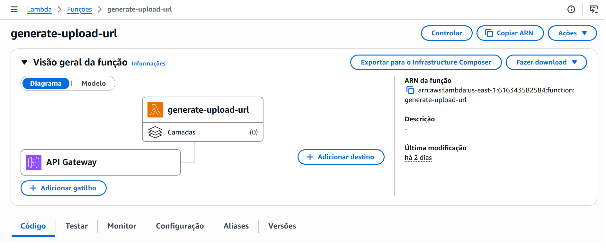
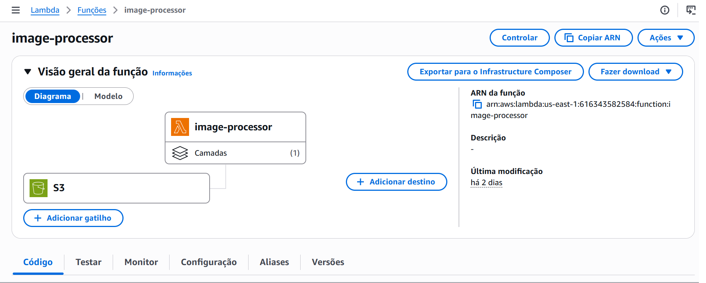
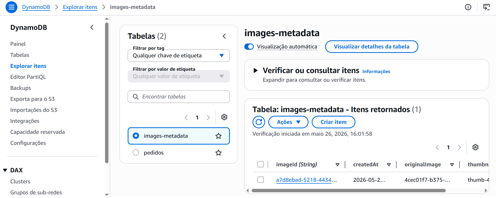
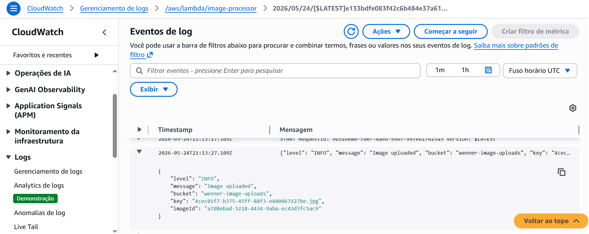

# 🛒 # aws-image-processing-backend

Backend serverless para upload, processamento e gerenciamento de imagens utilizando serviços gerenciados da AWS.

O projeto demonstra integração entre múltiplos serviços AWS utilizando boas práticas de:
- Geração de URLs pré-assinadas
- Upload seguro de imagens
- Processamento automático
- Observabilidade
- CI/CD automatizado

---

# 🚀 Arquitetura


---

# 📌 Visão Geral

Este projeto implementa um fluxo completo de upload e processamento de imagens utilizando:

- API Gateway
- AWS Lambda
- Lambda layers
- Amazon S3
- DynamoDB
- CloudWatch
- GitHub Actions (CI/CD)

---

# 🏗️ Fluxo da Aplicação

```text
Frontend React
   ↓
API Gateway
   ↓
Lambda generate-upload-url
   ↓
Presigned URL
   ↓
Upload direto no Amazon S3
   ↓
Evento S3 Trigger
   ↓
Lambda image-processor
   ↓
Imagem processada (S3) + metadados (DynamoDB)
```

---

# ⚙️ Tecnologias Utilizadas

- Python + boto3 + pillow
- API Gateway
- AWS Lambda + Layers
- S3
- DynamoDB
- CloudWatch
- GitHub Actions

---

# ✨ Funcionalidades

## ✅ Geração de Presigned URL

A função:
```text
generate-upload-url
```
gera URLs temporárias para upload seguro diretamente no S3.

Benefícios:
- Sem credenciais AWS no frontend
- Upload seguro
- Expiração automática
---

## ✅ Upload Direto para S3

As imagens são enviadas diretamente para:
```text
wenner-image-uploads
```
eliminando processamento intermediário no backend.

---

## ✅ Processamento Automático

Após upload:
- Evento S3 dispara Lambda
- Imagem é processada automaticamente
- Resize/compressão usando Pillow

A função:
```text
image-processor
```
- resize
- compressão
- geração de nova versão da imagem

---

## ✅ Armazenamento de Imagens

Buckets utilizados:
```text
wenner-image-uploads
wenner-image-thumbnails
```

---

## ✅ Persistência serverless

Metadados são armazenados na tabela DynamoDB:
```text
images-metadata
```

---

## ✅ Observabilidade

Logs estruturados em JSON contendo:

- log level
- message
- bucket
- id
- correlationId

Exemplo:
```text
{
  "level": "INFO",
  "message": "Image uploaded",
  "bucket": "wenner-image-uploads"
  "id": "a7d8ebad-5218-4434-9aba-ec43d3fc5ac9",
  "correlationId": "4cec01f7-b375-45ff-88f3-e440d67127be.jpg"
}
```

---

## ✅ CI/CD Automatizado

Pipeline GitHub Actions realiza:
- build
- empacotamento
- deploy automático na AWS Lambda

Trigger:
```text
git push
```

---

# 🔄 Pipeline CI/CD

Fluxo automatizado:

```text
Developer Push
      |
GitHub Actions
      |
AWS Lambda Deploy
```

Workflow:

```text
.github/workflows/deploy.yml
```

---

# 📂 Estrutura do Projeto

```text
aws-image-processing-backend/
│
├── architecture/
│   └── aws-architecture.png
│
├── screenshots/
│   ├── lambda-generate-upload-url.png
│   ├── lambda-image-processor.png
│   ├── s3.png
│   ├── dynamodb.png
│   └── cloudwatch.png
│
├── lambdas/
│   ├── generate-upload-url/
│   │   └── lambda_function.py
│   │
│   └── image-processor/
│       └── lambda_function.py
│
├── .github/
│   └── workflows/
│       └── deploy.yml
│
└── README.md
```

---

# ✨ Endpoints

## Gerar URL de Upload

```text
GET /upload-url
```

Resposta:
```text
{
  "uploadUrl": "https://..."
}
```

---

# 📸 Screenshots

## Lambda Generate URL



---

## Lambda Image Processor



---

## S3 Buckets


---

## DynamoDB



---

## CloudWatch Logs



---

# 🔐 Segurança

- HTTPS
- Presigned URLs
- Upload temporário
- IAM Roles
- Bucket Policies

---

# 📈 Próximas Evoluções

- Multi-user uploads
- Watermark
- Rekognition AI
- Terraform IaC
- CloudWatch alarms
- Step Functions orchestration

---

# 🎯 Projeto Relacionado

Frontend React:
```text
aws-image-upload-frontend
```

---

# 🎯 Conceitos AWS Demonstrados

- Arquitetura Serverless
- Arquitetura Event-Driven
- S3 Events
- Distributed Logging
- Infrastructure Automation
- Observabilidade
- CI/CD

---

# 👨‍💻 Autor

Wenner Baima Muniz

---

# 📄 Licença

MIT